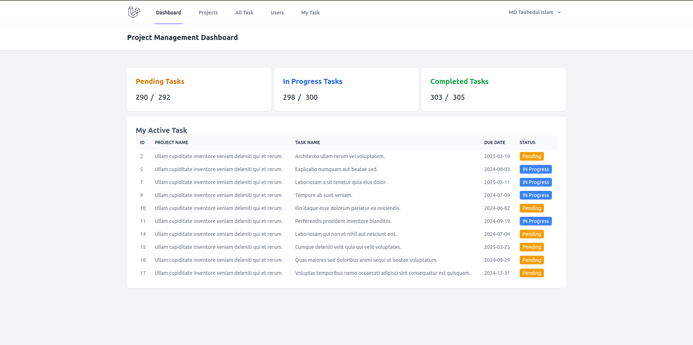
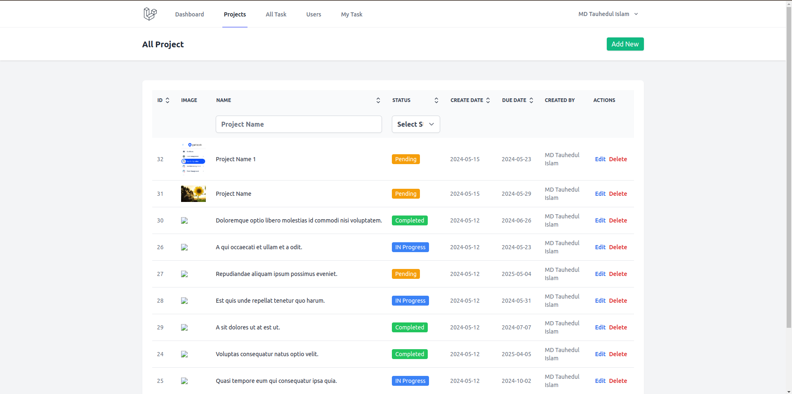
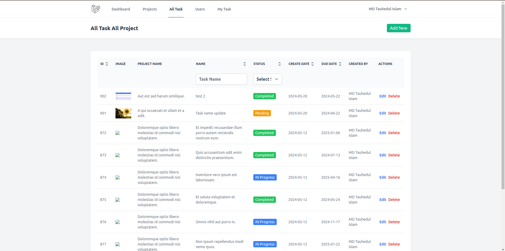
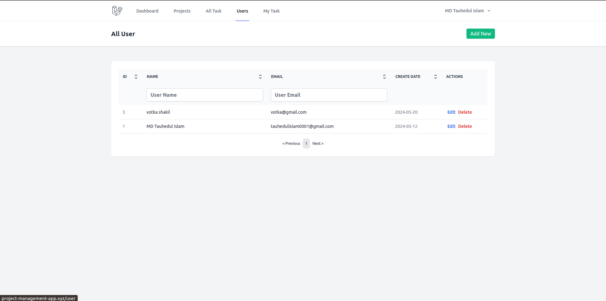
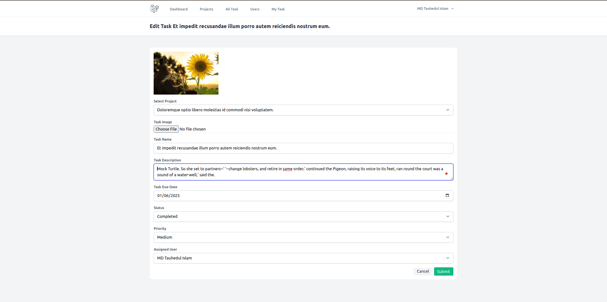

## Project Management System with Laravel, React, and Inertia.js

This project management system is a robust and user-friendly web application built with a powerful technology stack:

Laravel (Backend): Provides a secure and scalable foundation for managing user accounts, data persistence, business logic, and API endpoints.
React (Frontend): Offers a dynamic and interactive user interface, creating a single-page application (SPA) experience with seamless updates.
Inertia.js (Bridge): Acts as a bridge between Laravel and React, streamlining data exchange and rendering, ensuring a smooth and intuitive user experience.

## Core Features

## Project Management:
Create, view, edit, and delete projects efficiently.
Organize projects with flexible data structures.

## Task Management:
Create, view, edit, and delete tasks within projects.
Assign tasks to specific users for accountability and collaboration.
Track task progress effectively.

User Management:
Create, view, edit, and delete user accounts.
Implement user roles and permissions for secure access control.

My Tasks View:
Provide a dedicated view for users to see their assigned tasks, allowing them to focus on their individual responsibilities.

